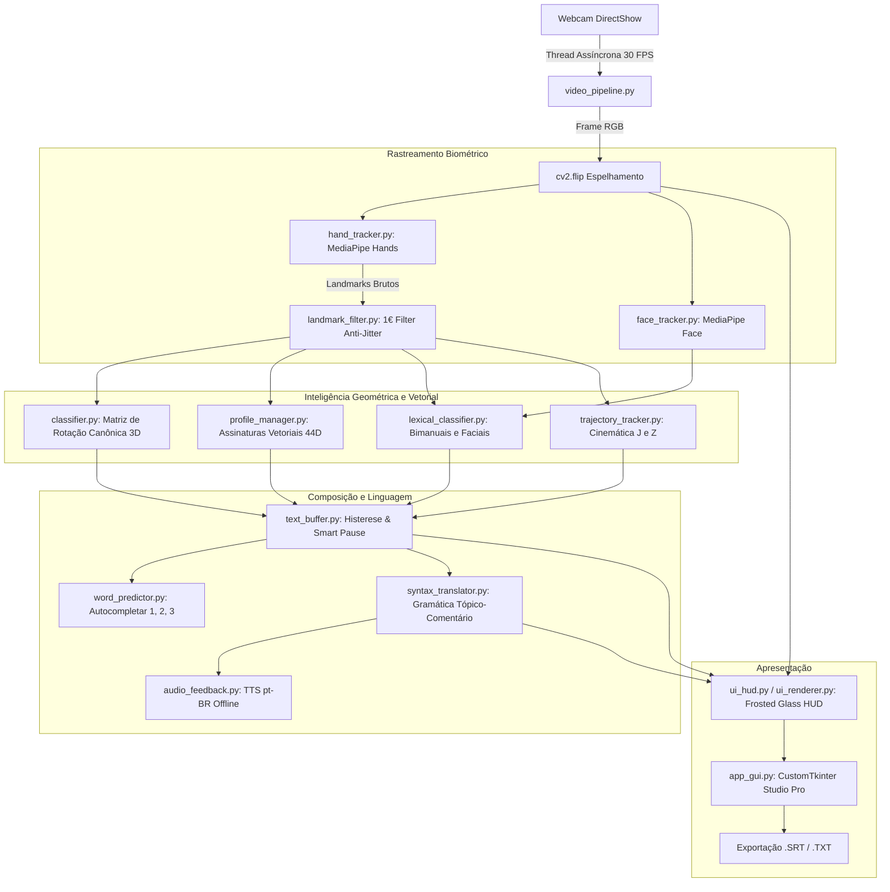

# 📚 Documentação Técnica — Libras Studio Pro
> **Plataforma de Visão Computacional, Estudo e Prática Interativa de Libras (Língua Brasileira de Sinais)**

---

## 📌 1. Visão Geral & Finalidade Pedagógica

O **Libras Studio Pro** é uma aplicação interativa desenvolvida em Python para **estudo, pesquisa e aprendizado da Língua Brasileira de Sinais (Libras)** por meio de visão computacional em tempo real. O sistema processa o feed de uma webcam comum, rastreia as articulações anatômicas das mãos e da face, reconhece o alfabeto datilológico (A-Z) e um vocabulário de sinais léxicos/bimanuais, e oferece tradução sintática para o português fluente com sintetização de voz (TTS).

```
  ┌────────────────────────────────────────────────────────────────────────┐
  │                 ⚠️ AVISO DE ESCOPO E PROPÓSITO DIDÁTICO                 │
  ├────────────────────────────────────────────────────────────────────────┤
  │ O Libras Studio Pro foi desenvolvido exclusivamente para FINS DIDÁTICOS,│
  │ DE ESTUDO, PESQUISA E EXPERIMENTAÇÃO TECNOLÓGICA.                      │
  │                                                                        │
  │ 1. Não substitui intérpretes: Esta ferramenta NÃO substitui Tradutores │
  │    e Intérpretes de Libras (TILS) certificados em contextos médicos,   │
  │    jurídicos, educacionais formais ou de radiodifusão.                 │
  │ 2. Complexidade Linguística: Libras é uma língua viva, rica e completa │
  │    (reconhecida pela Lei Federal nº 10.436/2002), dotada de gramática  │
  │    visual-espacial complexa que vai muito além de sinais isolados.     │
  │ 3. Valor Educativo: O software atua como um laboratório de treino      │
  │    motor para datilologia, conscientização sobre os parâmetros da     │
  │    língua e plataforma de estudo de visão computacional em tempo real. │
  └────────────────────────────────────────────────────────────────────────┘
```

---

## 🧬 2. Fundamentos da Libras Mapeados no Sistema

A linguística da Libras estabelece **5 parâmetros fonológicos principais** para a formação de qualquer sinal. A arquitetura do Libras Studio foi projetada para correlacionar diretamente esses parâmetros com componentes de visão computacional:

| Parâmetro de Libras | Descrição Linguística | Como o Libras Studio Trata |
| :--- | :--- | :--- |
| **1. Configuração de Mão (CM)** | Forma e postura que a mão assume no espaço. | Rastreamento de 21 landmarks 3D via MediaPipe, projeção em matriz local invariante à rotação e cálculo de extensão/flexão articular. |
| **2. Ponto de Articulação (PA)** | Região do corpo ou do espaço onde o sinal é produzido. | Rastreamento facial (queixo, boca, nariz, testa) e distância euclidiana das mãos em relação à face e ao tórax. |
| **3. Movimento (M)** | Deslocamento das mãos no espaço (direção, forma e velocidade). | Módulo `TrajectoryTracker` para análise de traçados cinemáticos (ex: letras **J** e **Z**) e derivadas temporais. |
| **4. Orientação da Palma (O)** | Direção para onde a palma da mão está voltada (cima, baixo, dentro, etc.). | Cálculo do vetor normal da palma ($\vec{n} = \vec{v}_{1} \times \vec{v}_{2}$) e vetor diretor longitudinal. |
| **5. Expressões Não-Manuais (ENM)** | Movimentos faciais, de cabeça e olhar (marcam tom gramatical, negação, interrogação). | Extração de marcos faciais de referência via MediaPipe Face Landmarker (base para futuras expansões). |

Além desses parâmetros, o sistema aborda dois níveis de comunicação em Libras:
* **Datilologia (Soletração Manual)**: Utilizada em Libras para nomes próprios, termos técnicos ou palavras sem sinal específico. Mapeada pelo classificador canônico de 26 letras (`A` a `Z`).
* **Sinais Léxicos (Palavras Inteiras)**: Sinais bimanuais (como *CASA*, *TRABALHO*, *FAMÍLIA*, *AJUDA*) e sinais faciais (como *ÁGUA*, *DESCULPA*, *BOM*, *SABER*), que transmitem conceitos completos sem necessidade de soletrar letra por letra.

---

## 🏗️ 3. Arquitetura de Software e Fluxo de Dados

O sistema adota uma **arquitetura multimodal desacoplada em threads**, garantindo processamento em tempo real (30+ FPS) em processadores convencionais (CPU) sem travamentos na interface gráfica.

### Diagrama do Pipeline



---

## 💻 4. Decomposição Modular dos Componentes

### 4.1. Captura e Pré-Processamento (`video_pipeline.py`)
* **Problema Resolvido**: O método padrão `cv2.VideoCapture.read()` do OpenCV acumula frames em buffer interno quando o processamento demora, gerando um atraso visual (lag) progressivo.
* **Solução Técnica**: Implementação da classe `ThreadedCamera`, que executa uma thread secundária dedicada à captura contínua via API **DirectShow** (`cv2.CAP_DSHOW` no Windows) e mantém um buffer atômico de apenas 1 frame mais recente. Caso o modelo demore alguns milissegundos a mais, nenhum lag é perceptível ao usuário.

### 4.2. Eliminação de Ruído com One-Euro Filter (`landmark_filter.py`)
* **Problema Resolvido**: Sensores de visão computacional apresentam tremor natural de alta frequência (*jitter*) nas coordenadas dos marcos da mão, tornando a classificação instável.
* **Solução Técnica**: Implementação do **One-Euro Filter ($1€\text{ Filter}$)**, um filtro de primeira ordem adaptativo baseado em velocidade:
  - Em repouso (baixa velocidade), aumenta a suavização, eliminando completamente a vibração.
  - Em movimento rápido, reduz a filtragem, preservando a resposta imediata da mão sem introduzir atraso perceptível.

### 4.3. Rastreamento Multimodal (`hand_tracker.py` e `face_tracker.py`)
* Suporte híbrido e automático entre as duas APIs do Google MediaPipe:
  1. **MediaPipe Tasks API (`mediapipe.tasks.vision`)**: Suporte nativo para versões recentes do Python (3.12 / 3.13), com download automático dos arquivos `.task` pré-treinados se ausentes.
  2. **MediaPipe Solutions Clássica (`mp.solutions.hands`)**: Fallback dinâmico para garantir compatibilidade retroativa.
* O `FaceTracker` extrai pontos fonológicos vitais: centro do queixo (landmark 152), lábio superior/inferior (marcos 13 e 14), ponta do nariz (landmark 1) e testa (landmark 10).

### 4.4. Classificador Canônico Invariante à Rotação (`classifier.py`)
* **Invariância à Rotação da Câmera**: Em vez de analisar as coordenadas puras da tela, o classificador projeta os 21 marcos da mão em um sistema de coordenadas local definido pela própria palma:
  $$\vec{v}_1 = \frac{lm[9] - lm[0]}{\|lm[9] - lm[0]\|} \quad (\text{Eixo longitudinal da palma})$$
  $$\vec{v}_2 = \frac{lm[17] - lm[5]}{\|lm[17] - lm[5]\|} \quad (\text{Eixo transversal da palma})$$
  $$\vec{v}_3 = \vec{v}_1 \times \vec{v}_2 \quad (\text{Vetor normal à superfície da palma})$$
* **Diferenciação Anatômica Fina**:
  - **Punhos Fechados (A, S, E)**: Verificação milimétrica da posição relativa do polegar sobre os nós dos outros dedos.
  - **Diferenciação de F e T**: O sinal **F** posiciona o polegar externamente ao indicador; o sinal **T** insere o polegar internamente entre o indicador e o médio.
  - **Orientação Gravitacional (M, N, Q)**: As letras M e N exigem dedos voltados estritamente para baixo ($v_y \ge -0.05$ no espaço da câmera), evitando falsos positivos com as letras E e W.

### 4.5. Assinaturas Vetoriais e Calibração Biométrica (`profile_manager.py` e `calibrator.py`)
* Nem todas as pessoas possuem a mesma proporção de mão ou flexibilidade articular.
* O `ProfileManager` constrói um vetor descritor denso de **44 dimensões**:
  - 15 coordenadas 3D das pontas dos dedos e juntas PIP no espaço normalizado;
  - 7 distâncias interdigitais normalizadas pelo comprimento do osso metacarpal;
  - 5 diferenciais de extensão longitudinal ($\Delta Y$ entre ponta e nó proximal);
  - Vetores diretores de orientação 2D.
* A similaridade de cosseno contínua compara a mão atual com o banco canônico e com as gravações do usuário em `user_sign_signatures.json`.
* O `Calibrator` oferece uma calibração rápida de 2 etapas (Mão Aberta e Punho Fechado em 5 segundos) para adaptar os limiares de abertura e fechamento à anatomia específica do usuário.

### 4.6. Buffer Temporal, Histerese e Smart Pause (`text_buffer.py`)
* **Supressão de Ruídos de Transição**: Durante o movimento da mão de um sinal para outro, ocorrem configurações anatômicas intermediárias involuntárias. O sistema rejeita frames durante fases de alta velocidade angular.
* **Histerese Temporal**: Um caractere só é aceito e inserido se o usuário sustentar a configuração com confiança por um período contínuo configurável (padrão: 0.8s).
* **Smart Pause**: Quando o usuário abaixa as mãos abaixo do campo de visão ou mantém repouso neutro por mais de 1.5s, o buffer infere o término da palavra e insere automaticamente um espaço, acionando a síntese de voz.

### 4.7. Tradutor Sintático de Libras (`syntax_translator.py`)
* Libras **não é português sinalizado**; possui morfossintaxe própria (geralmente Tópico-Comentário, Objeto-Verbo e ausência de verbos de ligação como "ser/estar").
* O `SyntaxTranslator` reestrutura frases em Libras para sentenças naturais do português falado:
  - Entrada em Libras: `"CASA EU IR QUERER"` $\rightarrow$ Tradução: `"Eu quero ir para casa."`
  - Entrada em Libras: `"VOCE NOME O QUE"` $\rightarrow$ Tradução: `"Qual é o seu nome?"`
  - Entrada em Libras: `"ÁGUA POR FAVOR"` $\rightarrow$ Tradução: `"Por favor, me dê água."`

### 4.8. Áudio e Feedback Sensorial (`audio_feedback.py`)
* Síntese de voz em português brasileiro utilizando `pyttsx3` acoplado à API nativa SAPI5 do Windows.
* A execução do TTS opera em uma **fila assíncrona desacoplada** (`queue.Queue`), impedindo que a reprodução da fala trave a taxa de quadros (FPS) da captura de vídeo.

### 4.9. Interface Gráfica Studio Pro (`app_gui.py`, `ui_hud.py` e `ui_renderer.py`)
* Interface moderna em **CustomTkinter** com tema escuro (Dark Mode).
* **Motor Gráfico com Efeito Frosted Glass**: Combinação de OpenCV com a biblioteca `Pillow (PIL)` para desenhar retângulos com cantos arredondados, desfoque gaussiano, iluminação cyber-glow e tipografia suave da fonte **Segoe UI**.
* **Modo Legendas Cinemático (`L`)**: Oculta os painéis técnicos e exibe apenas as legendas dinâmicas sobre o vídeo.
* **Exportação de Legendas**: Gera arquivos padrão de legendas de cinema e radiodifusão no formato **`.SRT`** com códigos de tempo milimétricos (`HH:MM:SS,mmm --> HH:MM:SS,mmm`) e arquivos `.TXT`.

---

## 🛠️ 5. Tecnologias Utilizadas e Justificativas

| Tecnologia | Função no Projeto | Justificativa da Escolha |
| :--- | :--- | :--- |
| **Python 3.10 - 3.13** | Linguagem principal | Ecossistema maduro em visão computacional, prototipagem ágil e facilidade de integração entre bibliotecas. |
| **MediaPipe (Google)** | Rastreamento de mãos e face | Modelos de aprendizado profundo otimizados para execução ultra-rápida em CPU (via delegate XNNPACK), permitindo 30+ FPS sem necessidade de placa de vídeo dedicada (GPU). |
| **OpenCV (`cv2`)** | Captura e manipulação visual | Eficiência no processamento de matrizes de pixels, suporte a DirectShow de baixa latência no Windows e ferramentas completas de renderização geométrica. |
| **NumPy** | Operações matemáticas e vetoriais | Cálculo veloz de produtos escalares, normas euclidianas, matrizes de rotação 3D e similaridade de cosseno com performance nativa em C. |
| **CustomTkinter** | Interface Desktop Studio Pro | Extensão do Tkinter tradicional com elementos modernos, suporte automático a temas visuais escuros, cantos arredondados e alta integrabilidade com embeds de imagem. |
| **Pillow (`PIL`)** | Tipografia anti-serrilhada e gráficos | Supera as limitações das fontes vetoriais brutas do OpenCV (`cv2.putText`), permitindo renderização tipográfica limpa em fontes do sistema como Segoe UI e Roboto. |
| **pyttsx3** | Síntese de voz (TTS) | Operação **100% offline**, sem necessidade de conexão com a internet, sem custos de API em nuvem e garantindo total privacidade do usuário. |
| **One-Euro Filter** | Filtragem cinemática | Algoritmo matemático consagrado para interfaces humano-computador que elimina o tremor em repouso sem gerar latência ao mover a mão. |

---

## 🚀 6. Pontos para Melhorias Futuras (Roadmap de Evolução)

Como projeto concebido para pesquisa e estudo contínuo de Libras e visão computacional, os seguintes pontos representam caminhos promissores de aprimoramento:

### 1. Modelos Espaço-Temporais Contínuos (Deep Learning)
* **Limitação Atual**: Os sinais dinâmicos e léxicos atuais dependem de heurísticas geométricas e janelas temporais fixas.
* **Melhoria Futura**: Implementar modelos de redes neurais baseados em grafos espaço-temporais (**ST-GCN — Spatial Temporal Graph Convolutional Networks**) ou arquiteturas **Transformer (ex: Sign Language Transformer)** para reconhecer frases contínuas fluidas sem necessidade de pausar entre cada sinal.

### 2. Captura Integral de Expressões Não-Manuais (ENMs)
* **Importância em Libras**: Na Libras, a elevação de sobrancelhas diferencia uma pergunta de uma afirmação, e o franzir da testa intensifica adjetivos.
* **Melhoria Futura**: Utilizar o pacote de **Face Blendshapes** do MediaPipe (que extrai 52 coeficientes de peso facial em tempo real) para detectar automaticamente expressões interrogativas, afirmativas e de espanto, integrando-as à gramática do `SyntaxTranslator`.

### 3. Rastreamento Corporal Completo (MediaPipe Pose / BlazePose)
* **Importância em Libras**: Muitos sinais de Libras utilizam o espaço neutro do abdômen, ombros e tronco (ex: *BOM DIA*, *PROFESSOR*, *OBRIGADO* em variação corporal).
* **Melhoria Futura**: Integrar o rastreador de pose esquelética com 33 pontos corporais para mapear sinais com pontos de articulação no tronco.

### 4. Tradução Sintática Apoiada por LLMs Locais (Small Language Models)
* **Limitação Atual**: O `SyntaxTranslator` opera por casamento de padrões e regras gramaticais estruturadas.
* **Melhoria Futura**: Integrar um modelo de linguagem compacto local (SLM) executado via CPU com quantização (ex: **Llama.cpp**, **Phi-3 Mini** ou **Gemma 2B**), treinado em pares de glosas de Libras e sentenças em Português para lidar com flexões contextuais e metáforas ricas da comunidade surda.

### 5. Modo "Duolingo de Libras" (Gamificação Pedagógica)
* **Melhoria Futura**: Criar um módulo interativo de lições práticas no Studio Pro:
  - O sistema exibe o sinal a ser realizado em vídeo/ilustração de referência.
  - A webcam acompanha a execução do estudante em tempo real.
  - Um indicador de precisão anatômica (0 a 100%) dá feedback instantâneo sobre erros comuns (ex: "Abra mais o polegar", "Incline mais a palma para frente").

### 6. Empacotamento para Usuário Final (Executável Stand-Alone)
* **Melhoria Futura**: Configurar rotina de compilação via `PyInstaller` ou `Nuitka` para gerar um instalador executável `.exe` único para Windows, permitindo que professores e estudantes sem conhecimento prévio de Python ou terminal possam utilizar o programa com um clique.

---

## 📖 7. Guia Rápido de Instalação e Execução

### Requisitos Mínimos
* Sistema Operacional: Windows 10 ou 11 (recomendado para DirectShow e síntese SAPI5), Linux ou macOS.
* Python: Versão 3.10 a 3.13.
* Webcam padrão (720p ou superior).

### Instalação

```powershell
# 1. Clonar o repositório
git clone https://github.com/NetoNog/Libras-Studio.git
cd Libras-Studio

# 2. Criar e ativar ambiente virtual (recomendado)
python -m venv venv
.\venv\Scripts\activate

# 3. Instalar as dependências
pip install -r requirements.txt
```

### Modos de Execução

```powershell
# Modo Padrão: Interface Desktop Studio Pro (CustomTkinter)
python main.py

# Modo Clássico: Janela Única OpenCV com HUD Direto
python main.py --opencv

# Executar a Suíte Completa de Testes Automatizados
python test_libras.py
```

---

## 📜 8. Ética, Acessibilidade e Comunidade

O **Libras Studio Pro** nasceu da crença de que a tecnologia e a inteligência artificial devem servir como ferramentas de inclusão social e estímulo ao aprendizado. Incentivamos fortemente estudantes e desenvolvedores a:
* Aprender com instrutores e professores surdos.
* Consultar materiais oficiais do **INES (Instituto Nacional de Educação de Surdos)**.
* Participar ativamente da comunidade e apoiar causas de acessibilidade e representatividade.
